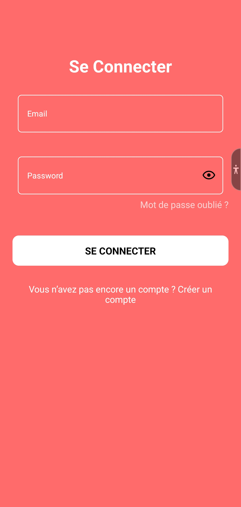
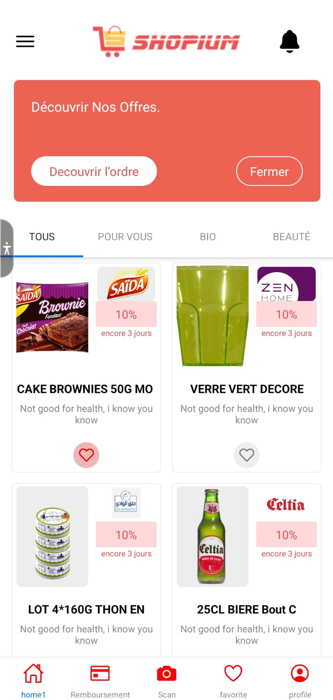
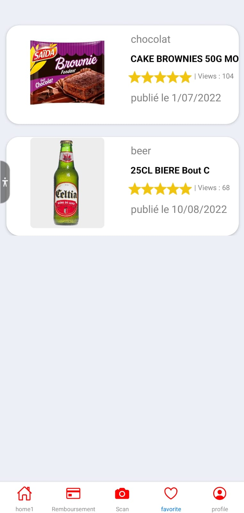
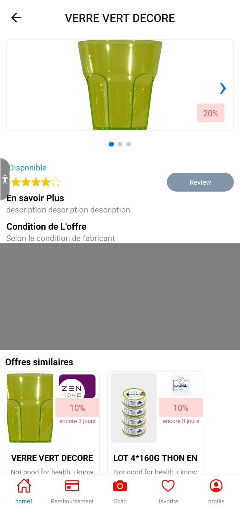
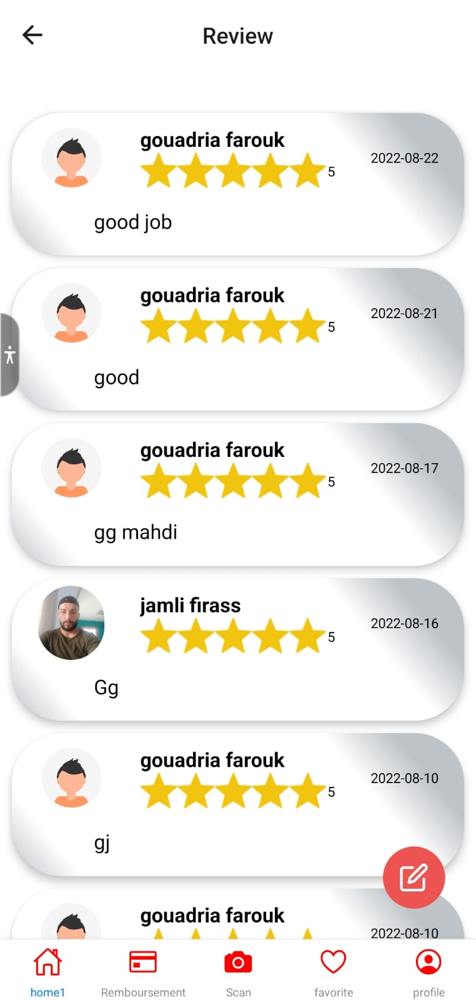
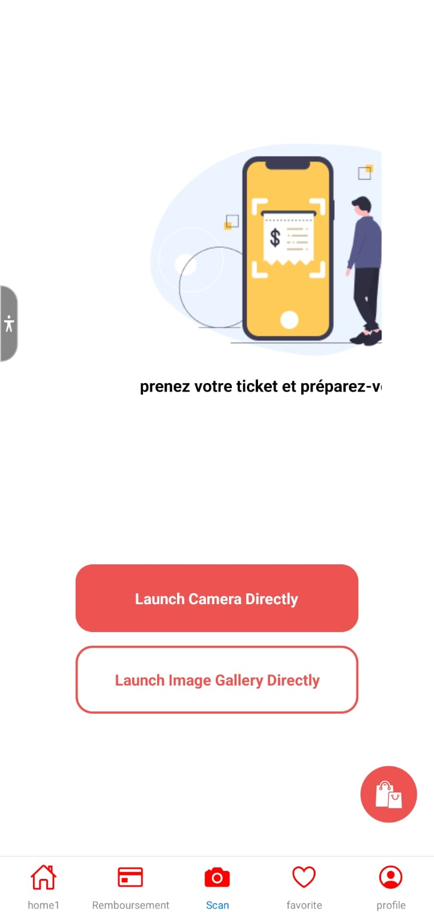
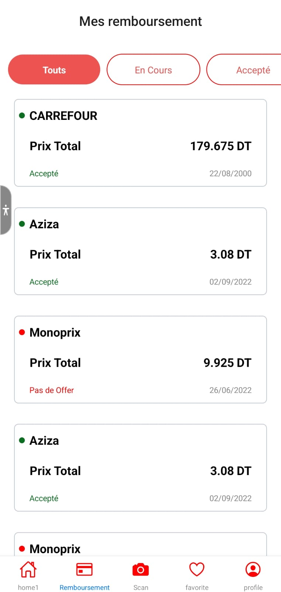

<a name="readme-top"></a>
<div align="center">

  
  <h1>Welcome To Shopium App</h1>
  
  
  <h1 >La première application du remboursement de courses en Tunisie :1st_place_medal: </h1> 
  <br/>
  <h1 align="center"> :receipt: :credit_card: :moneybag: </h1> 
  
<!-- Badges -->
<!-- <p>
  <a href="https://github.com/Louis3797/awesome-readme-template/graphs/contributors">
    
  </a>
  <a href="">
    
  </a>
  <a href="https://github.com/Louis3797/awesome-readme-template/network/members">
    
  </a>
  <a href="https://github.com/Louis3797/awesome-readme-template/stargazers">
    
  </a>
  <a href="https://github.com/Louis3797/awesome-readme-template/issues/">
    
  </a>
  <a href="https://github.com/Louis3797/awesome-readme-template/blob/master/LICENSE">
    
  </a>
</p> -->
   

</div>

<br />

<!-- Table of Contents -->
# :notebook_with_decorative_cover: Table of Contents

- [About the Project](#star2-about-the-project)
  * [Screenshots](#camera-screenshots)
  * [Tech Stack](#space_invader-tech-stack)
  * [Features](#dart-features)
  * [Color Reference](#art-color-reference)
  * [Environment Variables](#key-environment-variables)
- [Getting Started](#toolbox-getting-started)
  * [Prerequisites](#bangbang-prerequisites)
  * [Installation](#gear-installation)
  * [Run Locally](#running-run-locally)
- [Usage](#eyes-usage)
- [Roadmap](#compass-roadmap)
- [Contact](#handshake-contact)


  

<!-- About the Project -->
## :star2: About the Project
 <div> 
  <p><span>Shopium</span> est une application de cashback </p>
  <p>Shopium vous propose de profiter de remises lors de vos achats en magasin de manière simple et efficace. Il vous suffit de trouver les produits qui vous plaisent, de les acheter en magasin, de prendre une photo de votre reçu et de recevoir votre remboursement ! </p>
</div>

<!-- Screenshots -->
### :camera: Screenshots
  <p>Cette section présente une capture d'écran de notre application </p>
  <br>
  <p align = "center"> LOGIN & SIGNUP </p>
<div align="center"  > 
    </img>
        </img>
</div>
 <br>
 <p align = "center"> HOME & LIKES </p>

<div align="center"  > 
    </img>
        </img>
</div>
 <br>
 <p align = "center" font-weight="bold"> DETAILS & REVIEWS  </p>
<div align="center"  > 
    </img>
        </img>
</div>
 <br>
 <p align = "center"> SCAN TICKETS & STATUS  </p>
<div align="center"  > 
    </img>
        </img>
</div>


<!-- TechStack -->
### :space_invader: Tech Stack

<details>
  <summary>Client</summary>
  <ul>
    <li>
        <a href="https://reactnative.dev/" target="_blank" rel="noreferrer">React Native </a>
    </li>
  </ul>

</details>

<details>
  <summary>Server</summary>
  <ul>
    <li>
      <a href="https://nodejs.org" target="_blank" rel="noreferrer"> Node JS </a>
    </li>
    <li>
     <a href="https://expressjs.com" target="_blank" rel="noreferrer"> Express JS </a>
    </li>
  </ul>
</details>

<details>
<summary>Database</summary>
   <ul>
    <li>
        <a href="https://www.mongodb.com/" target="_blank" rel="noreferrer"> MongoDB </a>
    </li>
  </ul>

</details>

<details>
<summary>DevOps</summary>
  <ul>
    <li>
        <a href="https://www.heroku.com/" target="_blank" rel="noreferrer"> Heroku </a>
    </li>
</details>
<p align="right">(<a href="#readme-top">back to top</a>)</p>

<!-- Features -->
### :dart: Features

- Authentification
- Vérification Email
- Mise a jour Porfile
- Ajouter RIB
- Scanner Carte Fidélité
- Scanner Tickets ou Reçu de caisse
<p align="right">(<a href="#readme-top">back to top</a>)</p>

<!-- Color Reference -->
### :art: Color Reference

| Color             | Hex                                                                |
| ----------------- | ------------------------------------------------------------------ |
| Primary Color |  #FF6B6B |
| Secondary Color |  #EA3B3B |
| Accent Color |  #000000 |
| Text Color |  #FFFFFF |

<p align="right">(<a href="#readme-top">back to top</a>)</p>

<!-- Env Variables -->
### :key: Environment Variables

To run this project, you will need to add the following environment variables to your .env file

`BASE_URL`

`CLOUD_NAME`

`API_KEY_CLOUDINAY`

`URL_CLOUDINARY`
<p align="right">(<a href="#readme-top">back to top</a>)</p>

<!-- Getting Started -->
## 	:toolbox: Getting Started

<!-- Prerequisites -->
### :bangbang: Prerequisites

This project uses NPM (Node package manager) as package manager

```bash
https://nodejs.org/en/download/
```
verifier Node version 

```bash
 node -v
```
verifier npm version 

```bash
 npm -v
```
<p align="right">(<a href="#readme-top">back to top</a>)</p>

<!-- Installation -->
### :gear: Installation

Install my-project with npm

```bash
  npm install my-project
  cd my-project
```
   
<p align="right">(<a href="#readme-top">back to top</a>)</p>

### :running: Run Locally

Clone the project

```bash
  git clone https://github.com/FaroukGouadria/front-Shopium.git
```

Go to the project directory

```bash
  cd my-project
```

Install dependencies

```bash
  npm install
```

Start the server

```bash
  npx react-native run-android
```
<p align="right">(<a href="#readme-top">back to top</a>)</p>

<!-- Usage -->
## :eyes: Usage

mise en place d'une API externe développée avec intelligence artificielle conçue pour Shopium afin de scanner les reçus de vente des utilisateurs pour l'extraction et la classification des données.<a href="https://github.com/firas122/TicketOCR">Plus de détails</a>
<br>
<h2>Exemple :</h2>

 
<br>
<h2>Resultat</h2>
<br>

```javascript

  {
    "date": "26/06/2022",
    "name": "Monoprix",
    "products": [
        {
            "pname": "Huile de mais SAFI ",
            "pquantity": 1,
            "ptotal": 7730.0,
            "pupri": 7730.0
        },
        {
            "pname": "D. Timbre LF_2022",
            "pquantity": 1,
            "ptotal": 100.0,
            "pupri": 100.0
        },
        {
            "pname": "PECHE PLATE DE CHI ",
            "pquantity": 1,
            "ptotal": 2195.0,
            "pupri": 2195.0
        }
    ],
    "time": "13:21",
    "total": 100025.0
}
```
<p align="right">(<a href="#readme-top">back to top</a>)</p>

<!-- Roadmap -->
## :compass: Roadmap

* [x] Authentification
* [x] Gestion des utilisateurs 
* [x] Module Scan Tickets
* [ ] Remboursement
* [ ] Notification temps réel

<p align="right">(<a href="#readme-top">back to top</a>)</p>

<!-- Contact -->
## :handshake: Contact

Your Name - [@Shopium](https://twitter.com/Shopium) - shopium.local@gmail.com

Project Link: [https://github.com/FaroukGouadria/front-Shopium.git](https://github.com/FaroukGouadria/front-Shopium.git)

<p align="right">(<a href="#readme-top">back to top</a>)</p>


